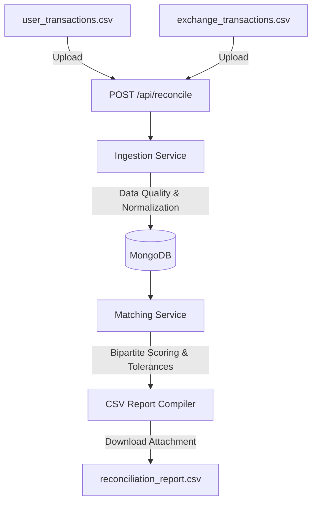

# Transaction Reconciliation Engine

A high-performance, production-grade **Transaction Reconciliation Engine** built in Node.js and MongoDB. It ingests transaction logs from two sources (User and Exchange), performs rigorous data quality validations, runs a configurable bipartite matching algorithm, and compiles a structured reconciliation report categorizing items into **Matched**, **Conflicting**, **Unmatched (User only)**, and **Unmatched (Exchange only)**.

---

## Architecture Overview



### 1. Ingestion Layer
Instead of dropping messy or corrupt rows silently, the engine parses every row, stores it in MongoDB, and logs detailed data validation issue strings under `validationErrors` with a status of `invalid`. It catches:
- Missing transaction IDs or key attributes.
- Malformed dates (validates ISO date structures).
- Non-positive or non-numerical quantities.
- Un-mappable or corrupt transaction types.

### 2. Matching Engine
The matching algorithm works in two passes:
- **First Pass (Exact ID Matches):** Pairs transactions by identical transaction IDs.
  - If assets match, types are compatible, and values are within tolerances, they are marked as **Matched**.
  - If key values (e.g., quantities, timestamps) exceed configured tolerances, they are marked as **Conflicting**.
- **Second Pass (Proximity Matching):** Pairs remaining transactions using a bipartite scoring algorithm:
  - Candidates must have same asset and compatible transaction type.
  - Matches are evaluated using a distance score:
    $$\text{Score} = \frac{\Delta\text{Time}}{\text{TimeTolerance}} + \frac{\Delta\text{Quantity}}{\text{QuantityTolerance}}$$
  - The closest candidate with the lowest score is selected.
  - If values fall within tolerance window, they are **Matched** (Proximity).
  - If they fall outside tolerance but are within a close proximity conflict boundary, they are flagged as **Conflicting** (Proximity deviation).
- **Final Pass (Unmatched):** Any remaining unpaired records are categorized as **Unmatched (User only)** or **Unmatched (Exchange only)**.

### 3. Database Schemas
- **`Transaction`**: Tracks `runId`, `source` (`user`/`exchange`), normalized values (`txId`, `timestamp`, `type`, `asset`, `quantity`), `original` row attributes as text, `status` (`valid`/`invalid`), and the list of `validationErrors`.
- **`ReconciliationRun`**: Acts as an audit ledger tracking metadata (tolerances used, timestamps, status) and aggregate processing metrics (matched counts, unmatched counts, and invalid record totals).

---

## Key Design Decisions & Unclear Requirements

During planning, several edge cases and unclear prompt requirements were resolved:
1. **Empty/Messy Inputs:** To fully prove out the ingestion engine, a CLI sample generator is included in the test directory to generate a messy sandbox of 10+ transactions with offsets, alias differences, and invalid records.
2. **Asset Synonyms:** The normalization layer handles aliases (e.g. `Bitcoin` / `btc` -> `BTC`, `Ethereum` / `eth` -> `ETH`) case-insensitively.
3. **Opposite Perspective Types:** Exchange `TRANSFER_IN` matches User `TRANSFER_OUT` (and vice-versa), while standard trade actions (`BUY`/`SELL`) must match exactly.
4. **Port Binding Isolation:** Consistent with modern security review guidelines, the web server is configured to bind strictly to `127.0.0.1` (localhost) rather than `0.0.0.0` to prevent unintended external exposure.
5. **NoSQL Injection Guard:** Alphanumeric validators protect request payloads before sending queries to Mongoose, completely avoiding raw NoSQL injections.
6. **Zero-Dependency Testing:** The automated test suite utilizes stub-based mock query layers, allowing it to run and pass instantly on any system without requiring an active MongoDB connection.

---

## Getting Started

### Prerequisites
- Node.js (>= 18.0.0)
- MongoDB (Optional, if running database audits)

### Installation
1. Clone the repository and navigate to the folder:
   ```bash
   cd reconciliation-engine
   ```
2. Install dependencies:
   ```bash
   npm install
   ```
3. Set up environment variables (optional, defaults are configured):
   ```bash
   cp .env.example .env
   ```

---

## Running the Application

### 1. Generate Sample Messy Datasets
Create the CSV datasets in the test directory:
```bash
npm run generate-data
```
This generates two messy files: `tests/user_transactions.csv` and `tests/exchange_transactions.csv`.

### 2. Start the Express Server
Launch the reconciliation REST API:
```bash
npm start
```
The server will start listening on `http://127.0.0.1:3000`.

### 3. Run Automated Tests
Run the zero-dependency test suite validating validation rules and matching tolerances:
```bash
npm test
```

---

## API Documentation

### 1. Perform Reconciliation
- **Endpoint:** `POST /api/reconcile`
- **Content-Type:** `multipart/form-data`
- **Request Body Fields:**
  - `user_transactions` (File): The user CSV transaction export.
  - `exchange_transactions` (File): The exchange CSV transaction export.
  - `timestampToleranceSeconds` (Integer, Optional): Override matching window (Default: `300`).
  - `quantityTolerancePct` (Float, Optional): Override quantity deviation tolerance (Default: `0.01`).
- **Response Headers:**
  - `Content-Type: text/csv`
  - `Content-Disposition: attachment; filename="reconciliation_report_[uuid].csv"`
- **Response Output:** Compiled RFC-4180 CSV containing matched and conflicting rows with explanation logs.

#### Example Request (curl)
```bash
curl -X POST http://127.0.0.1:3000/api/reconcile \
  -F "user_transactions=@tests/user_transactions.csv" \
  -F "exchange_transactions=@tests/exchange_transactions.csv" \
  -F "timestampToleranceSeconds=300" \
  -F "quantityTolerancePct=0.01" \
  --output tests/reconciliation_report.csv
```

### 2. Fetch Run Audits
- **Endpoint:** `GET /api/runs`
- **Response:** JSON list of the last 50 reconciliation runs including status metrics.
